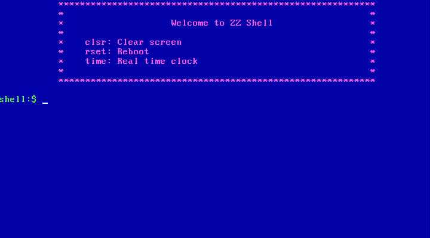
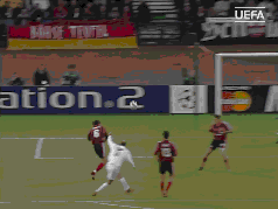

# x86 Zinedine Zidane Kernel

Maybe you think that Zinedine Zidane has achieved everything a man could want: money, fame, women and five championl leagues. However, you are wrong. Zidane does not have an operating system. The main objective of this project is to repair this injustice and give Zidane all he truly deserves.

## What is this project

It is actually a kernel on x86 to learn the basics made in college.

## Features

* Fisrt stage loader
* Second stage loader
* Protected mode (32 bits x86 code)
* GDT and IDT
* Usage of 8259 PIC
* CMOS IO operations (read clock registers)
* Simple video player (graphics mode 13H)
* Simple CLI using keyboard ISR

## CLI, zzshell

The CLI is implemented in */kernel/shell.asm* and is called **zzshell**. There are three orders available:

* **rset**: reboot kernel.
* **time**: print time.
* **clsr**: clear screen.



## Videoplayer

When you run zzkernel a video of Zidane's goal vs Bayer Leverkusen in 2002 UEFA Champions League Final is played. In file /bootloader/videoplayer.asm you can find how it's implemented using BIOS services. The video is /res/zz.raw (320x200 with 256 colors, 13H graphics mode), it has 39 frames and every frame occupies 125 sectors. The video is played after first stage loader just before entering protected mode (PE). In PE we couldn't use BIOS services.



## Prerequisites

* qemu-system-i386
* nasm

Using APT you can install them like this:

```sh
$ sudo apt-get update
$ sudo apt-get install nasm qemu-system-i386
```

## Build and run

Go to download folder and execute this:

```sh
$ mkdir build
$ cd build

$ nasm ../bootloader/bootloader.asm     -f bin -o bootloader.img
$ nasm ../bootloader/secondloader.asm   -f bin -o secondloader.img

$ cat bootloader.img    > final.img
$ cat secondloader.img >> final.img
$ cat ../res/zz.raw    >> final.img

$ qemu-system-i386 -drive file=final.img,format=raw,index=0,if=floppy
```
